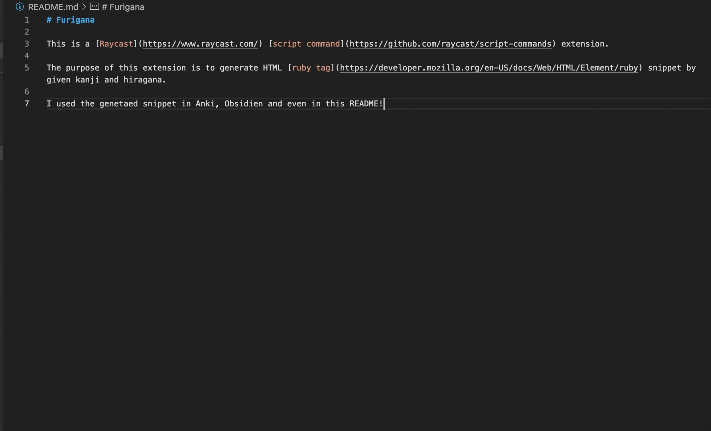

# Furigana

This is a [Raycast](https://www.raycast.com/) [script command](https://github.com/raycast/script-commands) extension.

The purpose of this extension is to generate HTML [ruby tag](https://developer.mozilla.org/en-US/docs/Web/HTML/Element/ruby) snippet by given kanji and hiragana.

I used the genetaed snippet in Anki, Obsidien and even in this <ruby>README <rt>リードミー</rt></ruby>!

## Demo

## Installation

Raycast Extensions Tab -> Add -> Add Script Directory